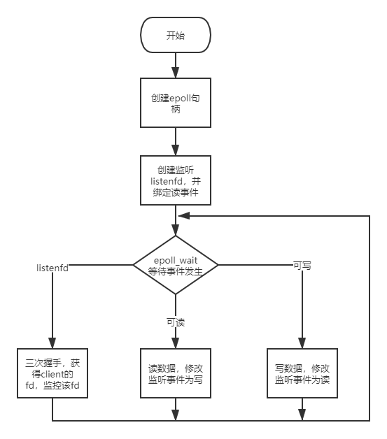

# 初识epoll

epoll作为linux内核最常用的通信方式，必须要好好了解一下他的用法，此处记录一下对epoll整个通讯流程的理解。




```
//1.第一步是创建epoll句柄
int epfd=epoll_create(256);

//2.建立一个监听socket，专门监听某个端口，并对所有尝试连接此端口的client，建立tcp连接
int listenfd= socket(AF_INET,SOCK_STREAM,0);
bind(listenfd,...);
listen(listenfd,...);

//3.把监听socket注册进句柄中，并监听该socket的读事件
epoll_event ev
ev.data.fd=listenfd
ev.events=EPOLLIN | EPOLLET;
epoll_ctl(epfd,EPOLL_CTL_ADD,listenfd,&ev);

//4.epoll_wait等待数据到来，如果监听的某个socket返回数据则进程苏醒进行处理，值得注意的是epoll只处理有数据返回的socket
epoll_event events[20];
while（1）{
	nfds=epoll_wait(epfd,events, ... );
	for(i=0;i<nfds;i++)
	//监听端口有数据到来，说明有新连接需要建立
	if(events[i].data.fd==listenfd)
	{
	
		//建立连接，并监听读事件
		int connfd=accept(listenfd,...);
		ev.data.fd=connfd;
		ev.events=EPOLLIN | EPOLLET//监听读事件
		epoll_ctl(epfd,EPOLL_CTL_ADD,connfd,&ev)
		
	}
	else if(events[i].events&EPOLLIN){
	
		//有数据可读，并修改监听事件为 “写”
		int sockfd=events[i].data.fd
		read(sockfd, ... );
		ev.events=EPOLLOUT | EPOLLET;
		epoll_ctl(epfd,EPOLL_CTL_MOD,sockfd,&ev)
		
	}
	else if(events[i].events&EPOLLOUT){
	
		//有数据可写，并修改监听事件为 “读”
		int sockfd=events[i].data.fd
		send(sockfd, ... );
		ev.events=EPOLLIN | EPOLLET;
		epoll_ctl(epfd,EPOLL_CTL_MOD,sockfd,&ev)
		
	}
}


```

